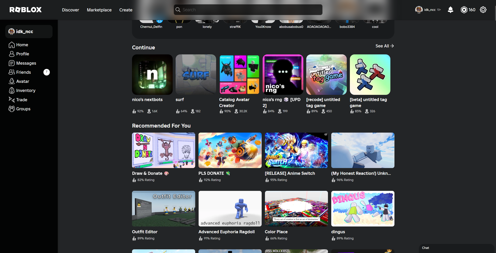
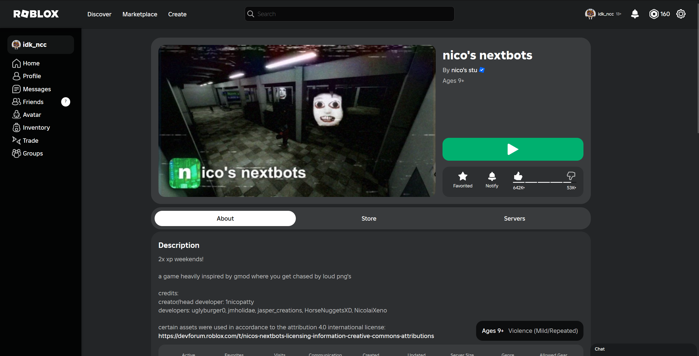
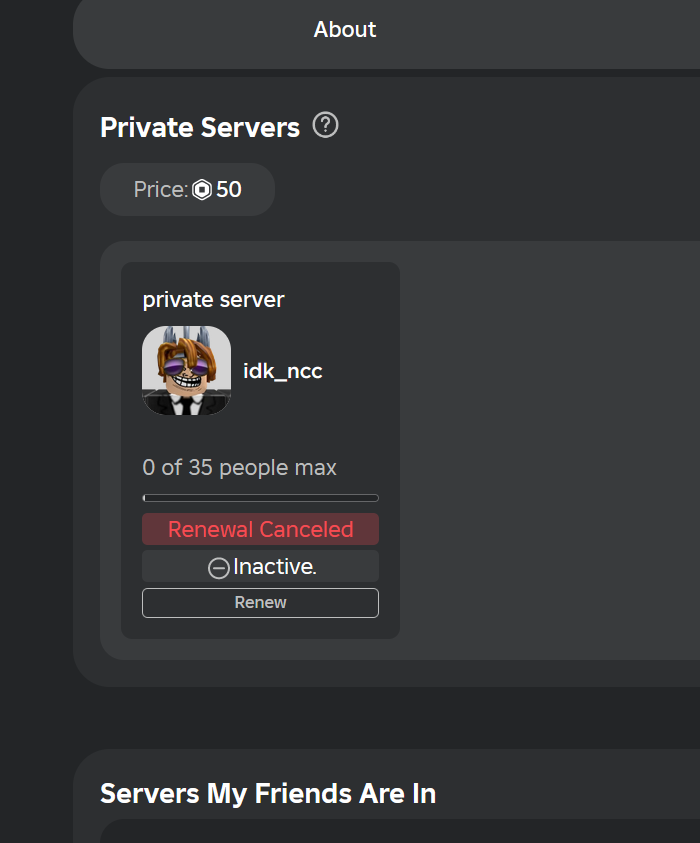
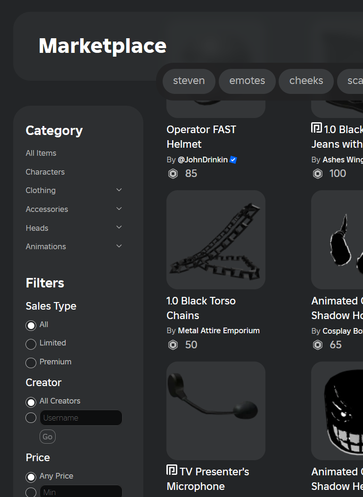

# Fluent Roblox

Perfect UI for Roblox

> TODO: better images






## Installation

### Userstyles.world

- https://userstyles.world/style/16043/fluent-roblox

### Manual

- Create custom style (with any userstyle extension)
- Place this code for domain `www.roblox.com`
  ```css
  @import url("https://fluent-roblox.idkncc.ru/main.css?v=1.0.1");
  ```

> [!WARNING]
>
> Stylesheet probably doesn't quite right working with roblox extensions.
> Also it doesn't support light theme

## TODO

- [ ] My Avatar
- [ ] Inventory page
- [ ] Messages page
- [ ] Trade page
- [ ] Group page
- [ ] Buy robux page
